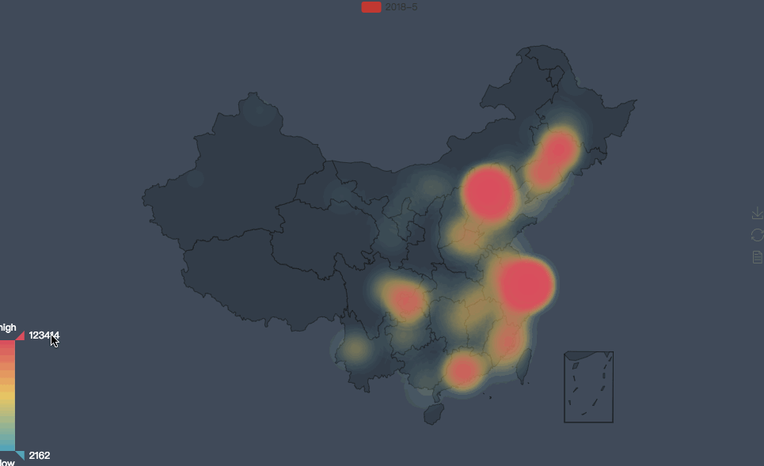
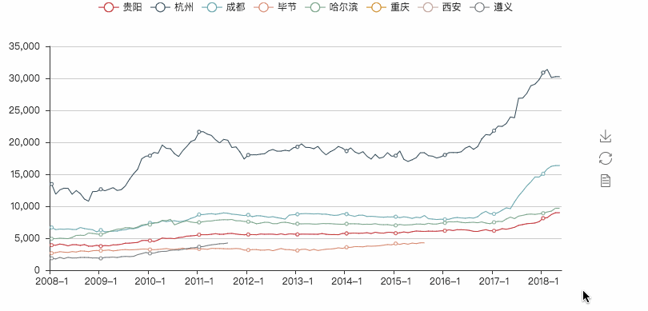

[TOC]

> 我相信国内房价一直都是苦逼程序员比较关注的事情，我也非常关注全国部分地区的房价，因此我最原始的需求就是想看看全国都哪些地方房价比较高，以及几个我比较关注的城市房价都是怎么个涨势。关于这两个功能，我并没有打算做很漂亮的应用，所以实现的思路也很简单粗暴，但它可以满足我的基本的需求。如果你也有需要，我们可以一起来完善这个应用，让他更通用。

**该网站现在已经不公开历史数据了，要花钱购买才能看了！收费是目前为止遇到最牛逼的反爬机制，本工程废弃只做参考用！**
**也别问我要数据了，我重装mysql的时候已经删掉了！有点可惜，有点感悟就是以后扒下来的数据不能轻易删了！最好转为 csv 上传大家一起分析。**


# 使用方法
我说了我并没有打算做很漂亮的应用，目前这个项目也只是可以满足我的基本需求，因此本项目稍微需要一点编程基础和mysql操作基础。至少要入门水平，然后就可以照着下面的步骤操作了：

1. 安装依赖： `pip install -r requirements.txt`
2. 安装mysql并设置密码然后进入后执行下面命令：
```sql
create database house DEFAULT CHARACTER SET utf8 COLLATE utf8_general_ci;
use house;
CREATE TABLE residential (
    record_id INT NOT NULL AUTO_INCREMENT,
    province VARCHAR(100) NOT NULL,
    city VARCHAR(100) NOT NULL,
    year YEAR NOT NULL,
    month TINYINT UNSIGNED, # DEFAULT 1
    price DOUBLE, # NOT NULL, 单位: 元/m^2
    url VARCHAR(100),
    PRIMARY KEY (record_id)
); 
```
3. 爬取房价数据到数据库（方便后期分析）： `python clawer.py`
4. 房价数据分析： 简单阅读修改 `price_analyse.py` 文件的内容后运行 `python price_analyse.py` 即可。

# 程序原理
## 数据来源
最初有这个需求的时候我就百度搜了一下有没有现成的房价数据可以直接分析，很可惜并没有找到，但是发现了下面这个网站：

http://www.creprice.cn/

简单的分析了一下网站的结构，发现它的数据非常好爬！于是马上决定就是它了。

> ps. 代码见光后应该很快就不能这么轻易爬了，如果爬的人多的话...该网站的反爬机制及将上线，到时候再...嗯，道高一尺魔高一丈/笑脸。

## 数据爬取

房价相关数据抓取下来怎么存呢？鉴于网站的房价数据现在可以轻易爬下来并不代表将来也可以轻易爬，为了保险起见还是决定先保存到数据库方便后期深入分析了。数据库需要什么结构呢？说实话我只是关心 在哪个省的哪个城市什么时候房价是多少，于是很自然的我的数据表包含了如下列： 省市/城市/年/月/房价 等几个关键数据。

下面首先介绍数据库的操作基本流程（windows用户需要自己适配用法了，关键步骤请看代码注释），然后介绍如何爬取该网站的房价信息，其实都很简单。

### mac下mysql安装&使用&创建库和表
1. 卸载以前的mysql（第一次安装的话就不用这么操作了）：
```sh
sudo rm /usr/local/mysql  
sudo rm -rf /usr/local/mysql*  
sudo rm -rf /Library/StartupItems/MySQLCOM  
sudo rm -rf /Library/PreferencePanes/My*  
vim /etc/hostconfig and removed the line MYSQLCOM=-YES-  
rm -rf ~/Library/PreferencePanes/My*  
sudo rm -rf /Library/Receipts/mysql*  
sudo rm -rf /Library/Receipts/MySQL*  
sudo rm -rf /var/db/receipts/com.mysql.* 
```

2. 安装mysql：
```sh
brew install mysql
mysql.server start # 手动启动
mysql.server stop # 手动停止
mysql -uroot # 默认没有密码, 登录后设置
SET PASSWORD FOR 'root'@'localhost' = PASSWORD('xyz123');
mysql -u root -p 'xyz123' # 登录
```

3. mysql基本操作：
```sql
mysql -u root -p # xyz123
# show databases;
create database house DEFAULT CHARACTER SET utf8 COLLATE utf8_general_ci; # drop database house
use house;
# 创建和删除
CREATE TABLE residential (
    record_id INT NOT NULL AUTO_INCREMENT,
    province VARCHAR(100) NOT NULL,
    city VARCHAR(100) NOT NULL,
    year YEAR NOT NULL,
    month TINYINT UNSIGNED, # DEFAULT 1
    price DOUBLE, # NOT NULL, 单位: 元/m^2
    PRIMARY KEY (record_id)
); 
# drop table residential;
# 表查看
show tables;
describe residential;
# 表修改
ALTER TABLE residential ALTER COLUMN month SET DEFAULT 1; # 修改字段默认值, COLUMN 可省
ALTER TABLE residential MODIFY price DOUBLE NOT NULL; # 设置字段非空
ALTER TABLE residential ADD desc_info VARCHAR(100); # 增加字段
ALTER TABLE residential CHANGE desc_info drop_col VARCHAR(100) NOT NULL; # 修改列名
ALTER TABLE residential DROP drop_col; # 删除字段
ALTER TABLE residential ADD url VARCHAR(100); 

CREATE TABLE test (
    record_id INT NOT NULL AUTO_INCREMENT,
    province VARCHAR(100) NOT NULL,
    city VARCHAR(100) NOT NULL,
    year YEAR NOT NULL,
    month TINYINT UNSIGNED, # DEFAULT 1
    price DOUBLE, # NOT NULL, 单位: 元/m^2
    url VARCHAR(100),
    PRIMARY KEY (record_id)
); 

# 数据增改查删
INSERT INTO residential(province ,city, year, price) VALUES('guizhou','guiyang',1992, 45000);
UPDATE residential SET province='GZ' WHERE province='guizhou';
SELECT * FROM residential;
DELETE FROM residential WHERE province='GZ';
DELETE FROM residential; # 删除全部数据
```

### 网站爬取分析
房价数据网站首页： http://www.creprice.cn/ 
手动查看房价信息的操作流程分析：
1. 打开 http://www.creprice.cn/naprice/funation.html 网站（可以注册登录：手机号+简单密码）
2. 点击任意省份，然后右边的查看更多，发现地址很有规律：http://www.creprice.cn/proprice/pcguangxi.html 前面都相似，后面就是`[pc+省份全拼]`， 可以以此来爬取全国各省数据（几个直辖市略有区别，具体参考项目的代码实现）。
3. 任何一个地址又分为 **住宅/办公/商铺** 相关的页面，地址分别也只是最后不一样： pcguangxi.html/pcguangxi-ty21.html/pcguangxi-ty22.html。*我当前只关注住宅的所以就只实现了爬取住宅的代码，其他的有需求时再说吧。*
4. 任何一个页面都包含时间选择和展开更多选项，但是展开的通常都没有实际数据。而其中时间对应的也是静态页面后缀，在上面的`.html`前加上日期即可，例如 `-ti201512.html` 遍历以上一些地方应该可以获取比较合理的数据结构了。

由此得到爬取流程：获取中国各省的汉字，然后生成各个省市的拼音，组合生成的年月相关字串，组装成网址；然后到该网址中找到城市名字和对应的房价，保存到数据库。

### 网站数据抓取代码基础
其实我也是边百度边尝试的，有些库我也没用过，都是百度后从库的基本使用去了解如何满足自己的需求，比如百度`python 汉字转拼音` 才知道还有pinyin这种库可以用。

1. 全国各省的汉字数据： https://github.com/baixuexiyang/geocoord
2. 汉字转拼音：`pip install pinyin`
```py
from pinyin
>>> print(pinyin.get('你 好'))
nǐ hǎo
>>> print(pinyin.get('你好', format="strip", delimiter=" "))
ni hao
>>> print(pinyin.get('你好', format="numerical"))
ni3hao3
>>> print(pinyin.get_initial('你好'))
n h
```
3. 省份网址生成器：
```py
def gen_all_url():
    for pr in PROVINCE_NAME:
        for year in range(NOW.year, 2007, -1):
            for month in range(12, 0, -1):
                pr['url'] = "%s/proprice/pc%s-ti%d%02d.html" % (BASE_URL, pr['pinyin'], year, month)
                pr['year'] = year
                pr['month'] = month
                yield pr
```
4. 网页下载器：
```py
import requests
res = requests.get('http://www.creprice.cn/proprice/pcguizhou-ti201803.html')
with open('test.html','w') as f:
    f.write(res.text)
```
其实我也没想到这个网站的爬取这么简单，连基本的反爬机制都没有，那我就只能不客气了！
5. 异步爬虫：没想到猴子补丁支持了requests但是对于mysql的支持并不好，而且这个网站动不动就被爬爆了。所以最后没有采用异步的方式。

最后爬取的过程大概是下面这样（看起来比较慢，爬完全部数据大概要3小时吧）：


## 数据分析
1. 数据读取: 数据库读取操作，获取数据后就直接查询数据库就好了，没什么技术含量。
2. 绘制房价的温度图: 参考代码，效果如下，是全国2018年房价的温度图。


<!-- <p><iframe style="width: 750; height: 450px;" src="./out/房价温度图-year_2018.html" frameborder="0" width="750" height="450"></iframe></p> -->

可以看出来除了北上广深杭以外，国内还有重庆/辽宁/吉林的房价都挺高的。更多信息大家就自己感受一下吧...


3. 绘制趋势线型图: 参考代码，效果如下，是几个城市的房价上涨趋势。


<!-- <p><iframe style="width: 750; height: 450px;" src="./out/贵阳,杭州,成都,毕节,哈尔滨,重庆,西安,遵义房价走势图.html" frameborder="0" width="750" height="450"></iframe></p> -->

这个图也说明了国内大部分省市的房价都是在上涨的，就我看的几个城市而言，从2017年1月开始都普遍大幅度上涨（当时到底发生了什么？），从上涨的趋势来看这几个城市都应该还有一定的上涨空间。如果要买房的话，可以考虑在那儿呢？---fuck...当然时看看在哪儿才买得起啊！

上面的两个图也只是举个例子啦，分析结果也就是我个人的简单直观的看法，相信大家看到的比我看到的多，期待听到大家深入浅出的分析结论。

源代码地址： [https://github.com/HeLiangHIT/house_price](https://github.com/HeLiangHIT/house_price)

> 最后在这个过程中我也发现了一个关于[租房数据自动爬取的项目](https://github.com/kezhenxu94/house-renting)，感兴趣的可以围观下。
> ps. 这个项目看起来比我这个麻烦多了，毕竟要适配多家中介机构的网站，维护起来应该也比较辛苦。


如果本源码对你有所帮助，可以点赞以支持作者的持续更新哦


